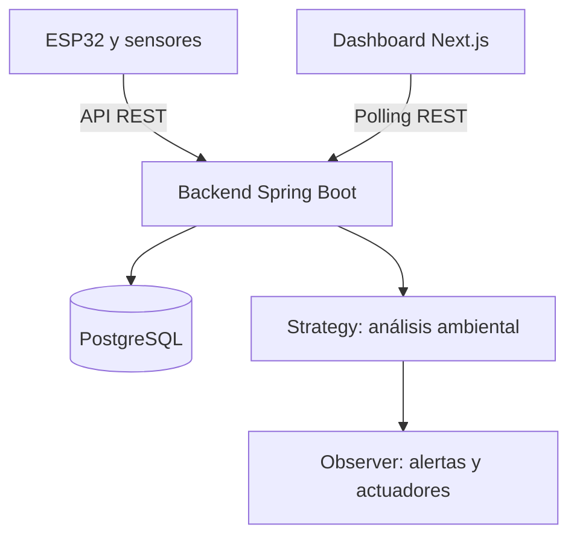

# Smart Greenhouse — Team Skynet

Sistema IoT de punta a punta para monitorear y controlar las condiciones ambientales de un invernadero mediante sensores, actuadores físicos, una API REST y un dashboard web.

> Proyecto académico colaborativo desarrollado durante 2026 para Ingeniería de Software y Hardware — FCEFyN, Universidad Nacional de Córdoba.

Este repositorio es una versión pública preparada para portfolio. La autoría continúa siendo grupal y el historial de Git conserva las contribuciones originales.

## Descripción

Smart Greenhouse registra temperatura, humedad, concentración de CO₂ e iluminación mediante una placa ESP32. Las mediciones son enviadas al backend, validadas, procesadas y almacenadas en PostgreSQL.

El sistema evalúa las condiciones ambientales mediante diferentes estrategias, genera alertas y comunica el estado tanto al dashboard web como a los actuadores físicos del invernadero.

## Arquitectura



El frontend se comunica exclusivamente con el backend. La ESP32 recopila las mediciones, mientras que Spring Boot concentra la validación, persistencia, evaluación ambiental y generación de alertas.

## Funcionalidades principales

- Lectura de temperatura, humedad, CO₂ y luminosidad.
- Envío de mediciones desde ESP32 mediante una API REST.
- Validación y persistencia de datos en PostgreSQL.
- Consulta de mediciones actuales e históricas.
- Algoritmos ambientales implementados mediante el patrón Strategy.
- Notificación de alertas mediante el patrón Observer.
- Visualización mediante un dashboard web.
- Activación de buzzer, LED RGB, ventilador, regador, resistencia térmica y tira LED.
- Testing automatizado para backend, frontend y firmware.
- Linters, hooks de Git e integración continua.

## Tecnologías

| Área | Tecnologías |
| --- | --- |
| Firmware | ESP32, C++17, PlatformIO, Arduino, GoogleTest |
| Backend | Java 21, Spring Boot, Gradle, REST, Liquibase, JUnit |
| Base de datos | PostgreSQL, Docker Compose |
| Frontend | TypeScript, Next.js, React, Recharts, Vitest |
| Calidad | Checkstyle, ESLint, Cppcheck, Git hooks, GitHub Actions |
| Gestión | Git, GitHub, Jira, Conventional Commits |

## Estructura principal

```text
backend/final-project/   Backend Java y Spring Boot
frontend/dashboard/     Dashboard web con Next.js
firmware/esp32/          Firmware, sensores y actuadores
docs/                    Arquitectura, requisitos y documentación técnica
.github/workflows/       Integración continua y automatización
TPs Practicos/           Trabajos formativos realizados durante la materia
```

## Testing y automatización

### Backend

```bash
cd backend/final-project
./gradlew test
./gradlew checkstyleMain checkstyleTest
```

### Frontend

```bash
cd frontend/dashboard
npm ci
npm run build
npm test -- --run
npm run lint
```

### Firmware

```bash
cd firmware/esp32
pio test -e native_test
pio check -e esp32dev
```

Los hooks de pre-commit y pre-push permiten ejecutar validaciones locales antes de integrar cambios. GitHub Actions ejecuta automáticamente builds y pruebas sobre los distintos componentes.

## Mis contribuciones — Franco Leonel Montes

Dentro del desarrollo grupal, mis principales contribuciones verificables fueron:

- Implementación de las estrategias de temperatura, humedad, CO₂, luz y promedio móvil.
- Desarrollo de tests unitarios para las estrategias ambientales.
- Testing del `SensorFactory` del firmware ESP32.
- Configuración de linters para backend, frontend y firmware.
- Implementación de un hook de pre-commit.
- Refactor y pruebas relacionadas con el patrón Observer.
- Participación en ramas, pull requests, integración, revisión y corrección de código.
- Colaboración en documentación técnica y gestión de tareas mediante Jira.

## Documentación

- [Descripción del sistema](docs/system-description.md)
- [Arquitectura](docs/architecture.md)
- [Requisitos](docs/requirements.md)
- [Especificación de la API](docs/api-spec.md)
- [Testing y automatización](docs/testing-and-automation.md)
- [Flujo de trabajo con Git](docs/git-workflow.md)
- [Gestión del proyecto](docs/project-management.md)

## Equipo

Consulte [CONTRIBUTORS.md](CONTRIBUTORS.md) para conocer los integrantes de Team Skynet y la atribución del proyecto.

## Licencia

Este proyecto conserva la **GNU General Public License v2** incluida en el repositorio académico original. Consulte [LICENSE](LICENSE).
