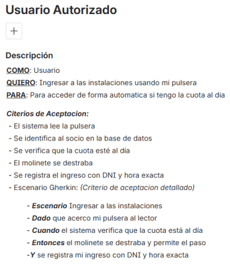
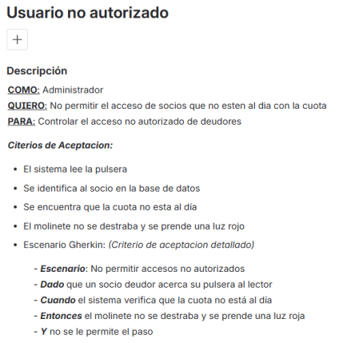
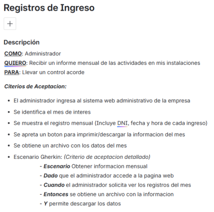

# Evidencias – TP Requerimientos E2E

## Historias de Usuario – Jira

### Usuario autorizado

---

### Usuario no autorizado

---

### Registros de ingreso

---

Las evidencias corresponden a las historias de usuario implementadas en Jira y desarrolladas en el documento principal del TP.