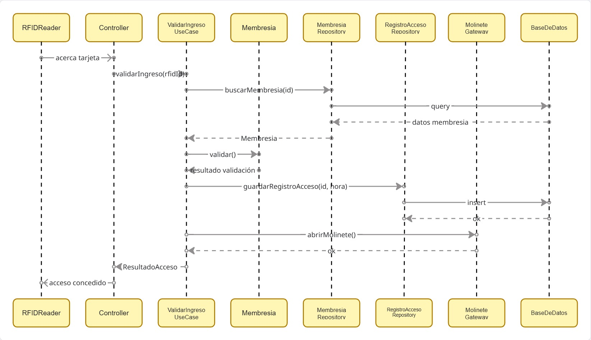
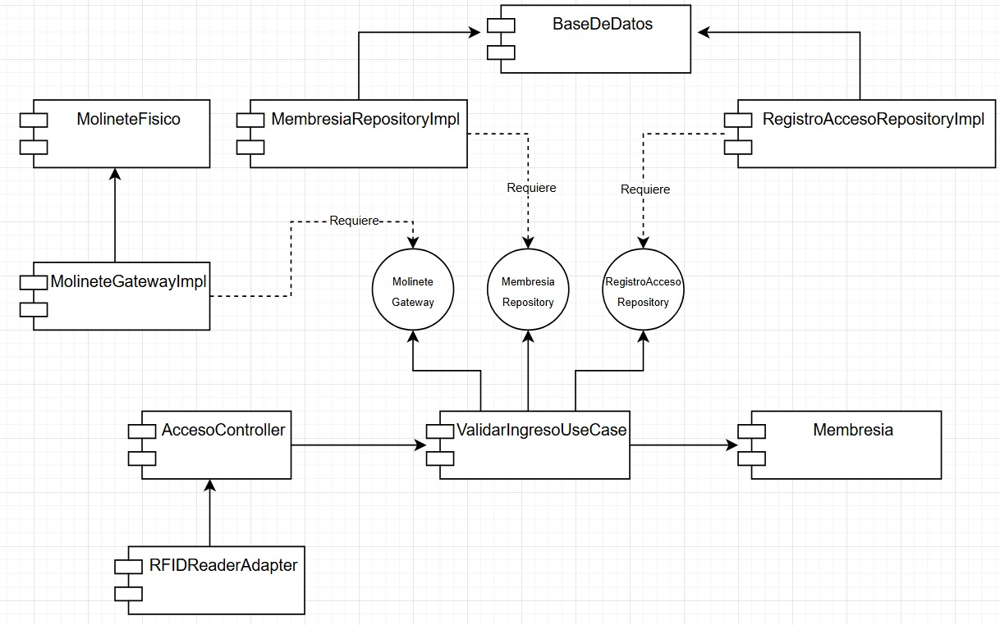

# Trabajo Práctico: Arquitectura y Flujo de Datos

## Caso de uso
Validar ingreso: el usuario acerca su tarjeta RFID al lector, el sistema valida la membresia, registra el acceso con hora y usuario y ordena la apertura del molinete.

## Arquitectura elegida
Clean Architecture

## Justificación
Se eligio Clean Architecture porque el sistema de control de acceso tiene una regla de negocio central clara: validar si una membresia esta activa y permitir o rechazar el ingreso. Esa logica debe quedar aislada de detalles tecnologicos como el lector RFID, la base de datos o el molinete fisico, y esta arquitectura nos permite separar la logica de negocio de estos detalles tecnologicos. Esto garantiza que los cambios en la infraestructura no afecten la logica central del sistema.
La Clean Architecture permite separar el nucleo del sistema de la infraestructura mediante la Regla de Dependencia: las capas externas pueden depender de las internas, pero las internas no deben depender de las externas. Por eso, el caso de uso y el dominio no conocen si la persistencia se realiza con MySQL, PostgreSQL, archivos o cualquier otra tecnologia, ni tampoco conocen el modelo concreto del molinete.

## Diagrama de Secuencia

## Diagrama de Componentes

## Responsabilidad de cada capa

### Capa de Dominio

Es el nucleo del sistema, contiene las entidades y las reglas de negocio puras, como `Membresia` y `RegistroAcceso`.
La entidad `Membresia` define cuando una membresia es valida, por ejemplo verificando si esta activa y si no esta vencida.
Esta capa no conoce base de datos, hardware, frameworks, controladores ni detalles tecnicos externos.

### Capa de Aplicacion

Contiene el caso de uso `ValidarIngresoUseCase`, y es la capa encargada de coordinar el flujo de la operacion.
Recibe el `rfidId`, solicita la busqueda de la membresia mediante la interfaz `MembresiaRepository`, evalua la regla de negocio del dominio, registra el acceso con usuario y hora mediante `RegistroAccesoRepository` y si corresponde solicita la apertura del molinete mediante `MolineteGateway`.
Esta capa no sabe como se consulta la base de datos ni como se abre fisicamente el molinete, y solo depende de interfaces.

### Interfaces o contratos

Las interfaces definen los contratos que la aplicacion necesita para comunicarse con elementos externos.
En este sistema se usan:
- `MembresiaRepository`
- `RegistroAccesoRepository`
- `MolineteGateway`

Estas interfaces permiten que la aplicacion dependa de abstracciones y no de implementaciones concretas.
Gracias a esto, se podria cambiar MySQL por PostgreSQL, o reemplazar el modelo del molinete sin modificar el caso de uso principal.

### Capa de Adaptadores de Interfaz

Esta capa traduce eventos externos a llamadas internas del sistema.
El `AccesoController` recibe el evento generado por el lector RFID y llama al caso de uso `ValidarIngresoUseCase`.
Su responsabilidad es adaptar la entrada al formato que necesita la aplicacion y no contiene logica de negocio.

### Capa de Infraestructura

Esta contiene los detalles tecnicos del sistema.
Aca se encuentran:
- `LectorRFIDAdapter`
- `MembresiaRepositoryImpl`
- `RegistroAccesoRepositoryImpl`
- `MolineteGatewayImpl`
- `AccessControlDB`

Esta capa implementa las interfaces definidas por las capas internas y realiza las operaciones concretas: leer desde el hardware RFID, consultar la base de datos, guardar el registro de acceso y enviar la orden fisica o de red al molinete.

### Flujo durante el pedido

El usuario acerca la tarjeta RFID al lector. El `LectorRFIDAdapter` captura el identificador y lo envia al `AccesoController`, y este llama al `ValidarIngresoUseCase`.

El caso de uso consulta la membresia mediante `MembresiaRepository`, evalua la logica del dominio para verificar si la membresia esta activa y vigente, registra el acceso mediante `RegistroAccesoRepository` y si corresponde solicita la apertura mediante `MolineteGateway`.
Las implementaciones concretas de esas interfaces viven en la capa de infraestructura. De esta forma se respeta la Regla de Dependencia de Clean Architecture: las capas externas dependen de las capas internas, pero las capas internas no dependen de las externas.